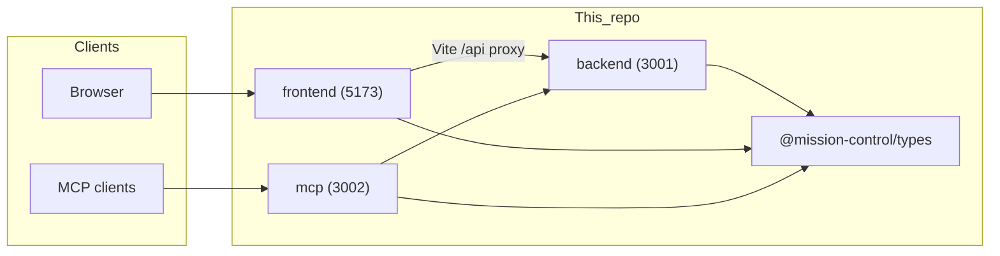

# Mission Control

Monorepo for the Mission Control dashboard: a **Fastify** backend, **React** (Vite) frontend, **MCP** server for tool integrations, and shared **TypeScript** types.

## Repository layout

| Package | Path | Role |
|--------|------|------|
| Backend API | [`backend/`](backend/) | REST API, auth, jobs, Discord integration, Postgres via Drizzle |
| Web UI | [`frontend/`](frontend/) | Vite + React + Tailwind |
| MCP server | [`mcp/`](mcp/) | Model Context Protocol server that talks to the backend |
| Shared types | [`packages/types/`](packages/types/) | Workspace package `@mission-control/types` |

Scripts for the whole repo live in the root [`package.json`](package.json).

## Prerequisites

- **Node.js** (LTS recommended) and **pnpm**
- **PostgreSQL** reachable by the backend (connection string belongs in [`backend/.env.example`](backend/.env.example))

## Quick start

From this directory:

```bash
pnpm install
pnpm dev
```

That runs the backend, frontend, and MCP server in parallel (see root `package.json` `dev` script). Preflight checks that dev ports **3001**, **3002**, and **5173** are free.

- **`pnpm dev:app`** — backend + frontend only (no MCP)
- **`pnpm dev:mcp`** — MCP package only

Other root commands: `pnpm build`, `pnpm test`, `pnpm lint`, `pnpm format`.

## Database migration baseline

- Migration history was consolidated into a single baseline file in [`supabase/migrations/`](supabase/migrations/).
- This is a breaking reset of migration history: existing databases must be dropped/reset before applying current migrations.
- For a fresh database, run:

```bash
pnpm --filter backend db:migrate
```

## Configuration

Do not duplicate environment variables here. Copy each package's **`.env.example`** to **`.env`** and adjust:

- [`backend/.env.example`](backend/.env.example) — database, API keys, dashboard secrets, Discord (optional), `PORT` (default **3001**)
- [`frontend/.env.example`](frontend/.env.example) — API URL for the Vite dev proxy
- [`mcp/.env.example`](mcp/.env.example) — backend URL, JWT, MCP API key, `PORT` (default **3002**)

Package-level READMEs describe how each piece uses those files.

## Architecture (high level)




## Agent Integration

Mission Control notifies registered AI agents via webhooks over Tailscale. Agents can receive project approvals, task assignments, and instruction updates.

→ **[Agent Integration Guide](docs/agent-integration.md)** — payload shapes, handler workflows, registration steps, MCP tools, and debugging.


## Agent Integration

Mission Control notifies registered AI agents via webhooks over Tailscale. Agents can receive project approvals, task assignments, and instruction updates.

→ **[Agent Integration Guide](docs/agent-integration.md)** — payload shapes, handler workflows, registration steps, MCP tools, and debugging.

## Contributing

When you change default ports, required environment variables, or primary `pnpm` scripts, update the relevant **`.env.example`** and skim the READMEs so links and one-line behavior notes stay accurate.
